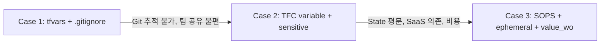

# Terraform Secret Management Workshop

> Terraform에서 시크릿을 관리하는 3가지 접근법을 비교하고, 각 방식의 보안 수준을 직접 검증해보는 핸즈온 세션

## 핸즈온 구조



| Case | 방식 | SSM 리소스 | State 평문 | 핵심 메시지 |
|------|------|----------|-----------|-----------|
| [Case 1](case1-tfvars/) | terraform.tfvars + .gitignore | api-key × 1 | **평문** | .gitignore는 Git에서 숨기는 것이지, 시크릿을 보호하는 것이 아니다 |
| [Case 2](case2-tfc-variable/) | TFC variable + sensitive | api-key × 1 | **평문** | sensitive는 화면에서 가리는 것이지, State에서 보호하는 것이 아니다 |
| [Case 3](case3-sops/) | SOPS + ephemeral + value_wo | api-key × 3 | **빈 문자열** | 시크릿이 전 구간에서 평문이 사라졌다 |

모든 Case는 **TFC backend**를 사용한다.

## 사전 준비

| 항목 | 필요 여부 | 비고 |
|------|----------|------|
| AWS 계정 | 필수 | SSM Parameter Store, KMS 접근 |
| TFC 계정 | 필수 | workspace 필요 |
| Terraform CLI | 필수 | >= 1.11 (ephemeral 지원) |
| SOPS CLI | Case 3 | macOS는 `brew install sops`, Windows는 공식 릴리스 바이너리 설치 후 `sops --version` 확인 |

### 워크숍 공통 준비

> 아래 절차는 **워크숍을 단순하게 진행하기 위한 준비 예시**다.  
> 운영 환경에서는 최소 권한 역할과 OIDC/Dynamic Credentials 구성을 권장한다.

#### 로컬 AWS CLI 준비

1. IAM user를 생성하고, 워크숍 단순화를 위해 필요한 권한을 부여한다.
2. 해당 IAM user의 access key를 생성한다.
3. 로컬에서 profile을 설정한다.

```bash
aws configure --profile secret-hands-on
```

4. 실습 세션에서 사용할 profile을 지정한다.

```bash
export AWS_PROFILE=secret-hands-on
```

5. 현재 자격증명이 정상인지 확인한다.

```bash
aws sts get-caller-identity
```

#### HCP Terraform workspace 준비

1. 각 Case별 workspace를 생성한다.
2. 워크숍 기준으로는 VCS 연결 없이 **CLI-driven 방식**으로 써도 충분하다.
3. workspace 변수에 아래 값을 **Environment variables**로 등록한다.

```text
AWS_ACCESS_KEY_ID
AWS_SECRET_ACCESS_KEY
```

### TFC Workspace 준비

| Workspace | Case | Working Directory |
|-----------|------|-------------------|
| `secret-workshop-case1` | Case 1 | `case1-tfvars` |
| `secret-workshop-case2` | Case 2 | `case2-tfc-variable` |
| `secret-workshop-case3` | Case 3 | `case3-sops` |

`main.tf`에는 `YOUR_ORG`, `YOUR_WORKSPACE` placeholder가 들어 있으므로 각 Case에서 본인 값으로 바꿔서 사용한다.

### HCP Terraform AWS 인증

Remote run을 사용할 경우, workspace에 **AWS 인증 정보가 미리 설정되어 있어야 한다**.

- **핸즈온 기본 세팅**: `AWS_ACCESS_KEY_ID`, `AWS_SECRET_ACCESS_KEY`를 **Environment variables**로 등록
- **선택 사항**: HCP Terraform Dynamic Provider Credentials를 쓸 경우 `TFC_AWS_PROVIDER_AUTH`, `TFC_AWS_RUN_ROLE_ARN`을 **Environment variables**로 등록

`TFC_AWS_PROVIDER_AUTH`, `TFC_AWS_RUN_ROLE_ARN`을 **Terraform variables**로 등록하면 remote run 로그에 undeclared variable 경고가 뜨고, AWS provider에서 아래와 같은 오류가 날 수 있다.

```text
Error: credential type web_identity_token_file requires role_arn
```

즉, 핸즈온 참석자는 **OIDC 설정 없이 access key 방식으로 진행해도 충분**하고, 발표자나 운영 환경에서만 필요하면 Dynamic Credentials를 사용하면 된다.

## 디렉토리 구조

```
terraform-secret-workshop/
├── README.md                          
├── case1-tfvars/                      # Case 1: terraform.tfvars (api-key × 1)
├── case2-tfc-variable/                # Case 2: TFC variable (api-key × 1)
├── case3-sops/                        # Case 3: SOPS (api-key × 3)
```

## 참고 자료

- [Terraform Ephemeral Values (v1.11)](https://www.hashicorp.com/en/blog/terraform-1-11-ephemeral-values-managed-resources-write-only-arguments)
- [SOPS - Secrets OPerationS](https://github.com/getsops/sops)
- [carlpett/sops Terraform Provider](https://registry.terraform.io/providers/carlpett/sops/latest/docs)
- [AWS KMS Key Policies](https://docs.aws.amazon.com/kms/latest/developerguide/key-policies.html)
