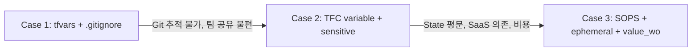

# Terraform Secret Management Workshop

> Terraform에서 시크릿을 관리하는 3가지 접근법을 비교하고, 각 방식의 보안 수준을 직접 검증해보는 핸즈온 세션

## 워크숍 구조



| Case | 방식 | SSM 리소스 | State 평문 | 핵심 메시지 |
|------|------|----------|-----------|-----------|
| [Case 1](case1-tfvars/) | terraform.tfvars + .gitignore | api-key × 1 | **평문** | .gitignore는 Git에서 숨기는 것이지, 시크릿을 보호하는 것이 아니다 |
| [Case 2](case2-tfc-variable/) | TFC variable + sensitive | api-key × 1 | **평문** | sensitive는 화면에서 가리는 것이지, State에서 보호하는 것이 아니다 |
| [Case 3](case3-sops/) | SOPS + ephemeral + value_wo | api-key × 3 | **빈 문자열** | 시크릿이 흐르는 전 구간에서 평문이 사라졌다 |

모든 Case는 **TFC backend**를 사용한다.
실습 재현성을 위해 **Case별로 별도 workspace 하나씩** 만드는 구성을 권장한다.

## 사전 준비

| 항목 | 필요 여부 | 비고 |
|------|----------|------|
| AWS 계정 | 필수 | SSM Parameter Store, KMS 접근 |
| TFC 계정 | 필수 | workspace 필요 |
| Terraform CLI | 필수 | >= 1.11 (ephemeral 지원) |
| SOPS CLI | Case 3 | `brew install sops` |

### TFC Workspace 준비

| Workspace | Case | Working Directory |
|-----------|------|-------------------|
| `secret-workshop-case1` | Case 1 | `case1-tfvars` |
| `secret-workshop-case2` | Case 2 | `case2-tfc-variable` |
| `secret-workshop-case3` | Case 3 | `case3-sops` |

`main.tf`에는 `YOUR_ORG`, `YOUR_WORKSPACE` placeholder가 들어 있으므로 각 Case에서 본인 값으로 바꿔서 사용한다.

## 디렉토리 구조

```
terraform-secret-workshop/
├── README.md                          
├── case1-tfvars/                      # Case 1: terraform.tfvars (api-key × 1)
├── case2-tfc-variable/                # Case 2: TFC variable (api-key × 1)
├── case3-sops/                        # Case 3: SOPS (api-key × 3)
```

## 참고 자료

- [Terraform Ephemeral Values (v1.11)](https://www.hashicorp.com/en/blog/terraform-1-11-ephemeral-values-managed-resources-write-only-arguments)
- [SOPS - Secrets OPerationS](https://github.com/getsops/sops)
- [carlpett/sops Terraform Provider](https://registry.terraform.io/providers/carlpett/sops/latest/docs)
- [AWS KMS Key Policies](https://docs.aws.amazon.com/kms/latest/developerguide/key-policies.html)
