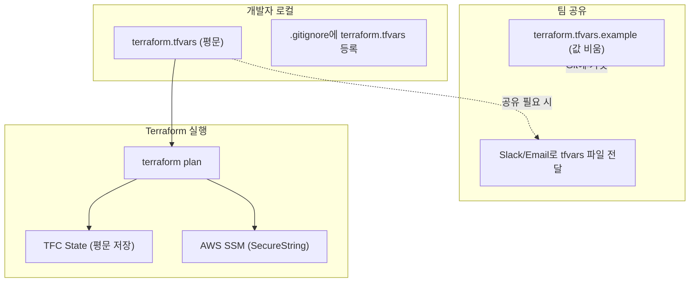

# Case 1: terraform.tfvars + .gitignore

## 학습 목표

- `terraform.tfvars`로 시크릿을 관리하는 기본 패턴을 이해한다
- `.gitignore`로 Git 추적을 제외해도 **시크릿이 보호되지 않는 이유**를 확인한다
- Terraform State에 시크릿이 **평문으로 저장**되는 것을 직접 검증한다

## 아키텍처



## 사전 준비

- AWS 계정 + 자격증명 (`aws configure` 완료)
- Terraform CLI >= 1.6.0
- TFC 계정 + workspace `secret-workshop-case1`
- jq (State JSON 파싱용)

## 실습 절차

### Step 1: 코드 확인

```bash
cd case1-tfvars

# 시크릿이 평문으로 들어있는 tfvars 파일 확인
cat terraform.tfvars

# .gitignore에서 tfvars 제외 확인
cat .gitignore

# SSM 리소스 코드 확인 — value = var.XXX 패턴
cat ssm.tf
```

### Step 2: terraform init + apply

```bash
# main.tf의 organization, workspace를 본인 TFC 값으로 수정 후
terraform init
terraform plan
terraform apply -auto-approve
```

### Step 3: SSM 확인 (정상 주입)

```bash
aws ssm get-parameter --name "/demo/api-key" --with-decryption \
  --query "Parameter.Value" --output text
# → sk-demo-a1b2c3d4e5f6
```

### Step 4: State 검증 (평문 노출 여부)

```bash
# state show — 겉으로는 가려져 보임
terraform state show 'aws_ssm_parameter.api_key'
# → value = (sensitive value)

# state pull — raw JSON에서 평문 노출!
terraform state pull | jq '.resources[] | select(.type=="aws_ssm_parameter") | .instances[].attributes | {name, value}'
# → { "name": "/demo/api-key", "value": "sk-demo-a1b2c3d4e5f6" }
```

#### `state show` vs `state pull` — 왜 결과가 다른가?

두 명령의 차이는 **State 데이터가 출력되기까지 거치는 경로**에 있다.

```
state show : State JSON → Provider 스키마 렌더링 → 화면 출력 (마스킹 O)
state pull : State JSON → 그대로 stdout 출력              (마스킹 X)
```

| 비교 항목 | `terraform state show` | `terraform state pull` |
|-----------|----------------------|----------------------|
| 출력 형식 | 사람이 읽기 쉬운 HCL-like 텍스트 | State 원본 JSON |
| 마스킹 여부 | Provider 스키마의 `Sensitive` 속성에 따라 마스킹 | 마스킹 없음 — 원본 그대로 |
| 의존 기준 | **Provider 스키마** (AWS Provider가 `value`를 `Sensitive: true`로 정의) | 없음 — 렌더링 레이어를 거치지 않음 |
| 사용자 `sensitive = true` 필요 여부 | 불필요 — Provider가 자체 마스킹 | 해당 없음 |

> **핵심**: `state show`의 `(sensitive value)` 표시는 **화면 표시용 보호**일 뿐이다.
> State 파일 자체에는 항상 평문이 저장되며, `state pull`이나 State 파일 직접 접근으로 누구든 확인할 수 있다.
>
> 즉, `variable`에 `sensitive = true`를 붙이든 안 붙이든, Provider 스키마가 마스킹하든 안 하든,
> **State 원본에는 평문이 들어있다**는 사실은 변하지 않는다.

### Step 5: 정리

```bash
terraform destroy -auto-approve
```

## 검증 결과

| 확인 항목 | 결과 |
|----------|------|
| terraform.tfvars | **평문** — 개발자 로컬에 파일로 존재 |
| .gitignore | Git 추적은 제외되지만 파일 자체는 평문 |
| terraform plan | `value = (sensitive value)` — 겉으로 가려짐 |
| TFC State | **평문** — `terraform state pull`로 노출 |
| AWS SSM | SecureString으로 정상 저장 |

## 이 방식의 한계

| 문제 | 설명 |
|------|------|
| **로컬 평문** | tfvars 파일이 개발자 머신에 평문으로 존재 |
| **팀 공유** | 새 팀원에게 Slack/Email로 tfvars 전달 → 채널에 평문 잔존 |
| **State 평문** | `terraform state pull`로 평문 노출 |
| **버전 관리 불가** | .gitignore로 제외했으므로 시크릿 변경 이력 추적 불가 |
| **환경별 관리** | dev/stg/prod별 tfvars 파일을 각각 관리해야 함 |

→ 다음: [Case 2: TFC variable + sensitive](../case2-tfc-variable/README.md)
