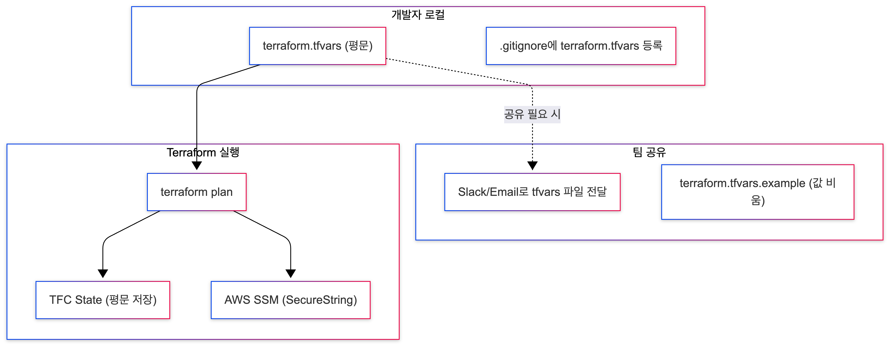
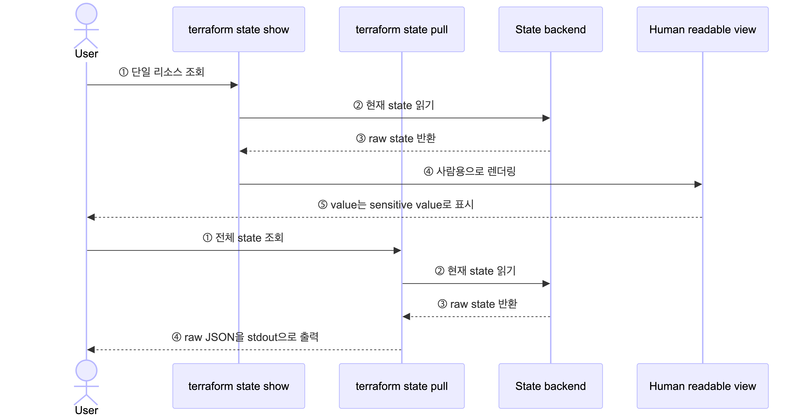

# Case 1: terraform.tfvars + .gitignore

## 실습 목표

- `terraform.tfvars`로 시크릿을 관리하는 기본 패턴을 이해한다
- `.gitignore`로 Git 추적을 제외해도 **시크릿이 보호되지 않는 이유**를 확인한다
- Terraform State에 시크릿이 **평문으로 저장**되는 것을 직접 검증한다

## case1 의 흐름



## 사전 준비

- AWS 계정 + 자격증명 (`aws configure` 완료)
- Terraform CLI >= 1.6.0
- TFC 계정 + workspace `secret-workshop-case1`
- jq (State JSON 파싱용)
- `main.tf`의 `organization`, `workspace`를 본인 HCP Terraform 값으로 미리 수정

### 워크숍 공통 준비

> 아래 절차는 **워크숍을 빠르게 진행하기 위한 단순화된 준비 예시**다.  
> 운영 환경에서는 IAM user + 장기 access key 대신 role과 OIDC/Dynamic Credentials를 권장한다.

#### 1. 로컬 AWS CLI profile 준비

1. IAM user를 생성하고 access key를 만든다.
2. 워크숍 단순화를 위해 필요한 권한을 부여한다.
3. 로컬 profile을 설정한다.

```bash
aws configure --profile secret-hands-on
```

4. 실습 세션에서 해당 profile을 사용한다.

```bash
export AWS_PROFILE=secret-hands-on
```

5. 현재 자격증명이 정상인지 확인한다.

```bash
aws sts get-caller-identity
```

#### 2. HCP Terraform workspace 준비

1. workspace를 생성한다.
2. 워크숍 기준으로는 VCS 연결 없이 **CLI-driven 방식**으로 진행해도 충분하다.
3. workspace 변수에 아래를 **Environment variables**로 등록한다.

```text
AWS_ACCESS_KEY_ID
AWS_SECRET_ACCESS_KEY
```

> HCP Terraform remote run을 쓴다면 workspace에 AWS 인증도 설정되어 있어야 한다.
> 핸즈온 진행은 workspace의 **Environment variables**에 `AWS_ACCESS_KEY_ID`, `AWS_SECRET_ACCESS_KEY`를 넣는 것이다.
> `TFC_AWS_PROVIDER_AUTH`, `TFC_AWS_RUN_ROLE_ARN`은 OIDC/Dynamic Credentials를 쓸 때만 쓰며, 반드시 **Terraform variable이 아니라 Environment variable**이어야 한다.
> undeclared variable 경고와 `credential type web_identity_token_file requires role_arn` 오류가 보이면 이 설정을 먼저 확인한다.

## 실습 절차

### Step 1: Terraform Login

```bash
# HCP Terraform을 처음 쓰는 환경이라면 1회 로그인
terraform login
```

### Step 2: Terraform Init

```bash
cd case1-tfvars
terraform init
```

### Step 3: 코드 준비

```bash
# 예시 파일을 실제 입력 파일로 복사
cp terraform.tfvars.example terraform.tfvars

# terraform.tfvars에 실제 값을 입력
# 예시
# api_key = "test1234"

# 시크릿이 평문으로 들어있는 tfvars 파일 확인
cat terraform.tfvars

# .gitignore에서 tfvars 제외 확인
cat .gitignore

# SSM 리소스 코드 확인 — value = var.XXX 패턴
cat ssm.tf
```

### Step 4: Terraform Plan

```bash
terraform plan
```

### Step 5: Terraform Apply

```bash
terraform apply -auto-approve
```

### Step 6: SSM 확인 (정상 주입)

```bash
# aws console 에서 확인

# 또는 aws cli로 확인
aws ssm get-parameter --name "/demo/api-key" --with-decryption \
  --query "Parameter.Value" --output text
# → "test1234"
```

### Step 7: State 검증 (평문 노출 여부)

```bash
# state show — 겉으로는 가려져 보임
terraform state show 'aws_ssm_parameter.api_key'
# → value = (sensitive value)

# state pull — raw JSON에서 평문 노출!
terraform state pull | jq '.resources[] | select(.type=="aws_ssm_parameter") | .instances[].attributes | {name, value}'
# → { "name": "/demo/api-key", "value": "sk-demo-a1b2c3d4e5f6" }
```

#### `state show` vs `state pull` — 왜 결과가 다른가?

제1원칙으로 쪼개면 확인할 질문은 4개뿐이다.

- ① Terraform은 이 값을 state에 저장하는가
- ② AWS provider는 이 값을 CLI에서 민감값으로 다루는가
- ③ `state show`는 사람이 보기 위한 출력인가
- ④ `state pull`은 raw state를 그대로 내보내는가

#### 공식 문서 팩트체크

- Terraform 문서는 **시크릿 값을 구성에 직접 넣으면 Terraform이 그 값을 state와 plan 파일에 저장한다**고 설명한다.
- Terraform 문서는 `sensitive`가 **CLI 출력과 HCP Terraform UI에서 값을 가리는 용도**라고 설명한다.
- Terraform 문서는 `terraform state show` 출력이 **human consumption** 용도라고 설명한다.
- Terraform 문서는 `terraform state pull`이 state를 내려받아 **raw format을 stdout으로 출력**한다고 설명한다.
- AWS provider 문서는 `aws_ssm_parameter.value`가 **plan output에서 항상 sensitive로 표시**된다고 설명한다.
- 같은 AWS provider 문서는 `value_wo`만이 **state에 저장되지 않는 write-only 값**이라고 설명한다.

즉, 이번 Case처럼 `value`를 쓰는 패턴에서는 **값이 state에 저장**되고, `state show`는 그 state를 **사람용으로 보여주면서 가리고**, `state pull`은 **raw state를 그대로 내보내기 때문에** `jq`로 평문을 뽑을 수 있다.

아래 설명은 위 공식 문서들을 조합한 해석이다.



| 질문 | 결론                                                              |
|------|-----------------------------------------------------------------|
| 왜 `state show`에서는 가려지나 | 사람용 출력이기 때문에 민감값이 나오지않는다                                        |
| 왜 `state pull`에서는 평문이 보이나 | raw state를 그대로 출력하기 때문이다                                        |
| `sensitive = true`를 붙이면 해결되나 | 아니다. 숨김은 CLI/UI용이고, 저장 자체를 막으려면 `ephemeral` 또는 write-only가 필요하다 |

#### 참고 문서

- [terraform state show](https://developer.hashicorp.com/terraform/cli/commands/state/show)
- [terraform state pull](https://developer.hashicorp.com/terraform/cli/commands/state/pull)
- [Manage sensitive data in your configuration](https://developer.hashicorp.com/terraform/language/manage-sensitive-data)
- [aws_ssm_parameter](https://registry.terraform.io/providers/hashicorp/aws/latest/docs/resources/ssm_parameter)

### Step 8: 정리

```bash
terraform destroy -auto-approve
```

## 검증 결과

| 확인 항목 | 결과 |
|----------|------|
| terraform.tfvars | **평문** — 개발자 로컬에 파일로 존재 |
| .gitignore | Git 추적은 제외되지만 파일 자체는 평문 |
| terraform plan | `value = (sensitive value)` — 겉으로 가려짐 |
| TFC State | **평문** — `terraform state pull`로 노출 |
| AWS SSM | SecureString으로 정상 저장 |

## 이 방식의 한계

| 문제 | 설명 |
|------|------|
| **로컬 평문** | tfvars 파일이 개발자 머신에 평문으로 존재 |
| **팀 공유** | 새 팀원에게 Slack/Email로 tfvars 전달 → 채널에 평문 잔존 |
| **State 평문** | `terraform state pull`로 평문 노출 |
| **버전 관리 불가** | .gitignore로 제외했으므로 시크릿 변경 이력 추적 불가 |
| **환경별 관리** | dev/stg/prod별 tfvars 파일을 각각 관리해야 함 |

→ 다음: [Case 2: TFC variable + sensitive](../case2-tfc-variable/README.md)
