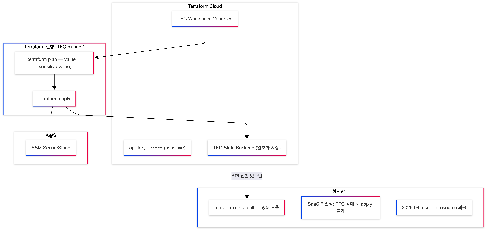

# Case 2: TFC workspace variable + sensitive

## 학습 목표

- `sensitive = true` 변수와 TFC workspace variable로 시크릿을 관리하는 패턴을 이해한다
- `sensitive = true`가 **CLI 출력만 가리고, State에는 평문이 저장**되는 것을 검증한다
- TFC의 SaaS 의존성과 2026-04 과금 모델 변경을 이해한다

## 아키텍처



## Case 1과의 차이점

| 항목 | Case 1 | Case 2 |
|------|--------|--------|
| 시크릿 저장 | terraform.tfvars (로컬 파일) | **TFC workspace variable** |
| sensitive | 미지정 | `sensitive = true` |
| tfvars 파일 | 필요 | **불필요** |

코드는 거의 동일하다. `variables.tf`에 `sensitive = true`만 추가되었을 뿐.

## 사전 준비

- AWS 계정 + 자격증명
- Terraform CLI >= 1.6.0
- TFC 계정 + workspace `secret-workshop-case2`
- TFC workspace variable에 `api_key` 등록 (sensitive 체크)
- jq

> 워크숍 기본 방식은 workspace의 **Environment variables**에 `AWS_ACCESS_KEY_ID`, `AWS_SECRET_ACCESS_KEY`, `AWS_SESSION_TOKEN`(필요 시)을 넣는 것이다.
> OIDC/Dynamic Credentials를 쓸 경우에만 `TFC_AWS_PROVIDER_AUTH`, `TFC_AWS_RUN_ROLE_ARN`을 **Environment variable**로 설정한다.

## 실습 절차

### Step 1: 코드 확인

```bash
cd case2-tfc-variable

# variables.tf — sensitive = true 확인
cat variables.tf

# ssm.tf — Case 1과 동일한 value = var.XXX 패턴
cat ssm.tf
```

### Step 2: TFC workspace variable 설정

TFC UI에서:
1. Workspace `secret-workshop-case2` → Variables
2. Add variable: `api_key` = `test1234` (Sensitive 체크)

### Step 3: terraform init + apply

```bash
# main.tf의 organization, workspace를 본인 TFC 값으로 수정 후
terraform init
terraform plan
# → "value = (sensitive value)" — 겉으로는 가려져 보인다
terraform apply -auto-approve
```

### Step 4: SSM 확인 (정상 주입)

```bash
# aws console 에서 확인


# 또는 aws cli 사용
aws ssm get-parameter --name "/demo/api-key" --with-decryption \
  --query "Parameter.Value" --output text
# → "test1234" (정상)
```

### Step 5: State 검증 (평문 노출 여부)

```bash
# state show — 마스킹되어 보임
terraform state show 'aws_ssm_parameter.api_key'
# → value = (sensitive value)

# state pull — 평문 노출!
terraform state pull | jq '.resources[] | select(.type=="aws_ssm_parameter") | .instances[].attributes | {name, value}'
# → { "name": "/demo/api-key", "value": "test1234" }
```

**"기억할 점"**: `sensitive = true`는 화면에서 가리는 것이지, State에서 보호하는 것이 아니다!

### Step 6: 정리

```bash
terraform destroy -auto-approve
```

## 검증 결과

| 확인 항목 | 결과                                |
|----------|-----------------------------------|
| 로컬 파일 | 없음 (TFC에 저장)                      |
| terraform plan | `value = (sensitive value)` — 가려짐 |
| terraform state show | `value = (sensitive value)` — 가려짐 |
| terraform state pull | **평문 노출** — `"test1234"`          |
| AWS SSM | SecureString으로 정상 저장              |

## 이 방식의 한계

| 문제 | 설명 |
|------|------|
| **State 평문** | `sensitive = true`는 CLI 출력만 가림, State에는 평문 저장 |
| **SaaS 의존성** | TFC 장애 시 plan/apply 불가, State 접근 불가 |
| **비용 모델 변경** | 2026-04부터 **user → resource 기반 과금** |
| **권한 확산** | TFC workspace 접근 권한 있는 사람은 누구나 state pull 가능 |
| **감사 한계** | 누가 어떤 변수를 변경했는지 TFC audit log에 의존 |

### TFC 비용 모델 변경 (2026-04)

| 항목 | 변경 전 (user 기반) | 변경 후 (resource 기반) |
|------|-------------------|---------------------|
| 과금 단위 | 사용자 수 | **Managed Resource 수** |
| SSM 143개 | 사용자 수와 무관 | 143 managed resources로 카운트 |
| 영향 | 소규모 팀에 유리 | 리소스가 많으면 비용 급증 |

> **핵심 메시지**: `sensitive = true`는 화면에서 가리는 것이지, State에서 보호하는 것이 아니다.

→ 다음: [Case 3: SOPS + ephemeral + value_wo](../case3-sops/README.md)
