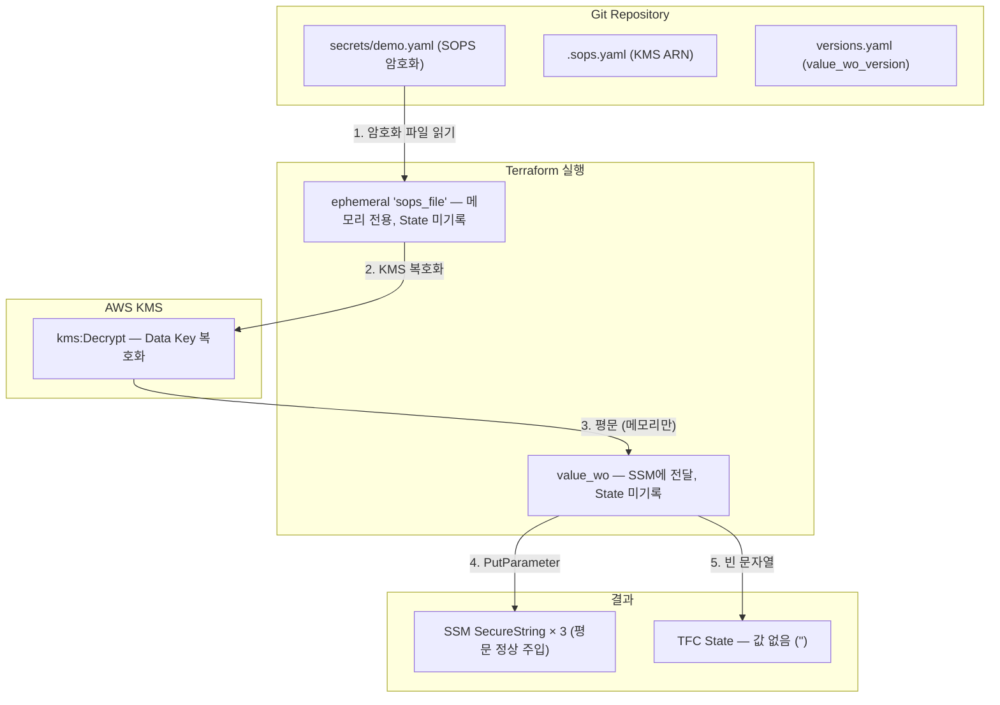

# Case 3: SOPS + ephemeral + value_wo (Zero-Secret)

## 학습 목표

- SOPS(KMS envelope encryption)로 시크릿을 암호화하여 **Git에 안전하게 커밋**하는 방법을 이해한다
- `ephemeral` 리소스와 `value_wo` 속성으로 **State에서도 평문을 제거**하는 패턴을 실습한다
- `versions.yaml`로 **value_wo_version을 관리**하는 패턴을 이해한다
- Case 1, 2와 `terraform state pull` 결과를 비교하여 Zero-Secret을 검증한다

## 아키텍처



## Case 1, 2와의 차이점

| 항목 | Case 1 (tfvars) | Case 2 (TFC variable) | Case 3 (SOPS) |
|------|----------------|---------------------|-------------|
| 시크릿 저장 | 로컬 파일 | TFC SaaS | **Git (암호화)** |
| SSM 리소스 | 1개 | 1개 | **3개** (for_each + versions.yaml) |
| State 평문 | 평문 | 평문 | **빈 문자열** |
| 값 변경 감지 | 자동 | 자동 | **versions.yaml bump** |

## 사전 준비

- AWS 계정 + 자격증명 (KMS, SSM 권한)
- Terraform CLI >= **1.11** (ephemeral 리소스 지원)
- TFC 계정 + workspace `secret-workshop-case3`
- SOPS CLI (`brew install sops`)
- jq

## 실습 절차

### Step 1: KMS Key 생성 (1st apply)

```bash
cd case3-sops

# main.tf의 organization, workspace를 본인 TFC 값으로 수정 후
terraform init

# KMS Key만 먼저 생성
terraform apply -target='aws_kms_key.sops' -target='aws_kms_alias.sops'

# KMS ARN 확인
terraform output kms_key_arn
# → arn:aws:kms:ap-northeast-2:123456789012:key/abcd-1234-...
```

### Step 2: SOPS 파일 생성

```bash
# .sops.yaml은 sops가 자동 생성하지 않는다.
# 프로젝트 루트(case3-sops/)에 템플릿을 복사해 직접 만든다.
# ⚠️ secrets/ 안에 두면 case3-sops/에서 sops 명령 실행 시 찾지 못할 수 있다.
cp .sops.yaml.example .sops.yaml

# terraform output -raw kms_key_arn 결과를 .sops.yaml의 kms 값에 붙여넣는다
# 예: kms: "arn:aws:kms:ap-northeast-2:123456789012:key/abcd-1234-..."
vi .sops.yaml

# 평문 예시를 복사하여 실제 SOPS 파일 생성
cp secrets/demo.yaml.example secrets/demo.yaml

# SOPS로 암호화 (로컬 AWS 자격증명에 KMS Encrypt 권한 필요)
sops --encrypt --in-place secrets/demo.yaml

# 암호화 확인 — 값이 ENC[AES256_GCM,...] 형태로 변환됨
cat secrets/demo.yaml

# 복호화 테스트 — KMS 권한이 있으면 평문으로 출력
sops -d secrets/demo.yaml
```

### Step 3: SSM Parameter 생성 (2nd apply)

```bash
terraform apply

# 예상 출력:
# Plan: 3 to add, 0 to change, 0 to destroy.
# ephemeral.sops_file.demo: Opening...
# ephemeral.sops_file.demo: Closing...
# aws_ssm_parameter.demo["/demo/api-key-1"]: Creating...
# aws_ssm_parameter.demo["/demo/api-key-2"]: Creating...
# aws_ssm_parameter.demo["/demo/api-key-3"]: Creating...
```

### Step 4: SSM 확인 (정상 주입)

```bash
aws ssm get-parameter --name "/demo/api-key-1" --with-decryption \
  --query "Parameter.Value" --output text
# → sk-demo-alpha-a1b2c3 (정상)
```

### Step 5: State 검증 (Zero-Secret!)

```bash
# state show — "write-only attribute"로 표시
terraform state show 'aws_ssm_parameter.demo["/demo/api-key-1"]'
# → value_wo = (write-only attribute)

# state pull — 빈 문자열! 평문 없음!
terraform state pull | jq '.resources[] | select(.type=="aws_ssm_parameter") | .instances[].attributes | {name, value, value_wo}'
# → { "name": "/demo/api-key-1", "value": "", "value_wo": "" }
# → { "name": "/demo/api-key-2", "value": "", "value_wo": "" }
# → { "name": "/demo/api-key-3", "value": "", "value_wo": "" }
```

**Case 1, 2와 비교:**

| 확인 방법 | Case 1 (tfvars) | Case 2 (sensitive) | Case 3 (SOPS) |
|----------|----------------|-------------------|--------------|
| state show | `(sensitive value)` | `(sensitive value)` | `(write-only attribute)` |
| state pull | **`"sk-demo-a1b2c3d4e5f6"`** | **`"sk-demo-a1b2c3d4e5f6"`** | **`""`** |

### Step 6: 값 변경 시나리오 (value_wo_version)

```bash
# 1. SOPS 파일에서 값 수정
sops secrets/demo.yaml
# 에디터에서 /demo/api-key-1 의 값을 변경

# 2. versions.yaml에서 해당 키의 버전 bump
# "/demo/api-key-1": 1  →  "/demo/api-key-1": 2

# 3. terraform plan → 변경 감지
terraform plan
# ~ aws_ssm_parameter.demo["/demo/api-key-1"]
#     ~ value_wo_version = 1 → 2
```

### Step 7: 정리

```bash
terraform destroy -auto-approve
```

## 주요 개념

### versions.yaml — value_wo_version 관리

```yaml
# versions.yaml
"/demo/api-key-1": 1    # 값 변경 시 → 2로 bump
"/demo/api-key-2": 1
"/demo/api-key-3": 1
```

- `value_wo`는 State에 없으므로 Terraform이 값 변경을 자동 감지할 수 없다
- `versions.yaml`에서 해당 키의 숫자를 +1하면 `value_wo_version`이 변경되어 apply 트리거
- **시크릿 추가 시**: versions.yaml에 새 키 추가 + SOPS 파일에 값 추가 → `terraform plan` → N to add

### for_each 패턴

```hcl
resource "aws_ssm_parameter" "demo" {
  for_each = local.versions                                    # versions.yaml의 map

  name             = each.key                                  # "/demo/api-key-1"
  value_wo         = ephemeral.sops_file.demo.data[each.key]   # 메모리의 평문
  value_wo_version = each.value                                # 1, 2, 3...
}
```

versions.yaml이 `for_each`의 source of truth — 시크릿 추가/삭제가 이 파일 하나로 관리된다.

## 검증 결과

| 확인 항목 | 결과 |
|----------|------|
| Git | **암호화** 상태로 커밋 (ENC[AES256_GCM,...]) |
| 로컬 파일 | 암호화됨 (KMS 없이 복호화 불가) |
| terraform plan | `value_wo = (write-only attribute)` |
| terraform state pull | **빈 문자열** — 평문 없음 (3개 모두) |
| AWS SSM | SecureString으로 **정상 저장** |

## Case 1/2의 문제가 어떻게 해결되는가

| 이전 문제 | Case 3의 해결 |
|---------|-------------|
| 로컬/State 평문 | ephemeral + value_wo → **메모리에서만 존재** |
| 팀 공유 불편 | SOPS 파일을 **Git으로 공유** (암호화 상태) |
| 버전 관리 불가 | **Git diff**로 시크릿 변경 이력 추적 |
| SaaS 의존성 | 자체 KMS 키 — TFC 없이도 동작 가능 |
| 비용 | KMS API 호출 비용만 (~$0.03/10,000건) |
